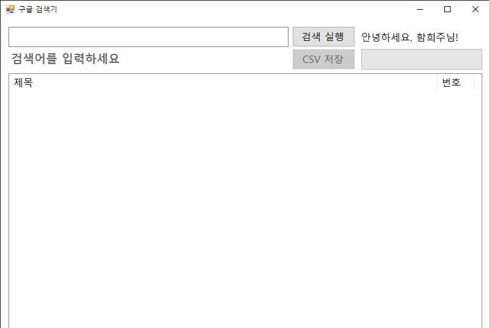
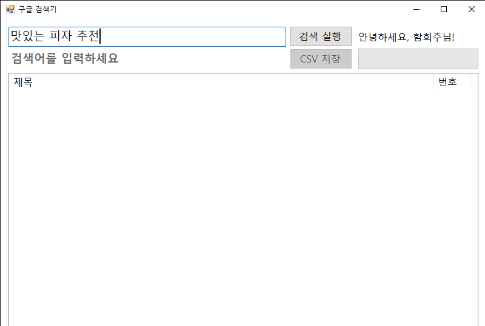
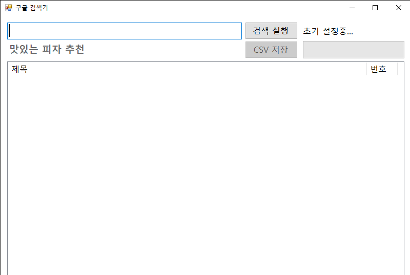
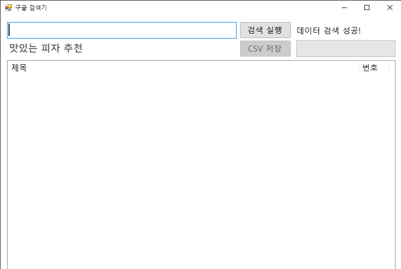
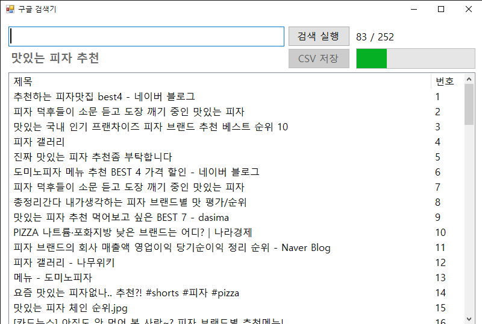
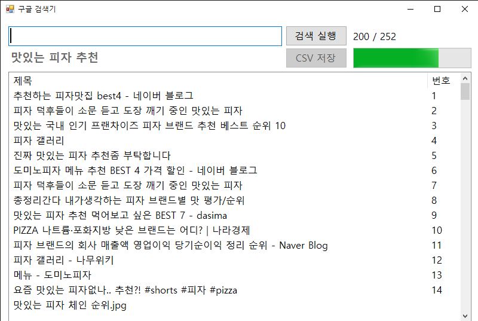
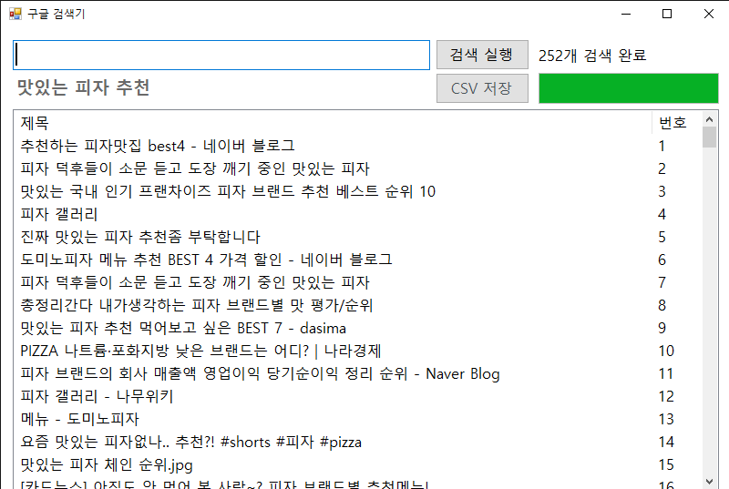
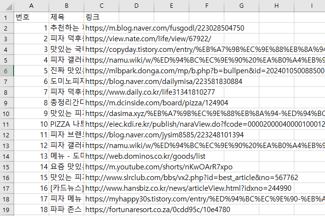
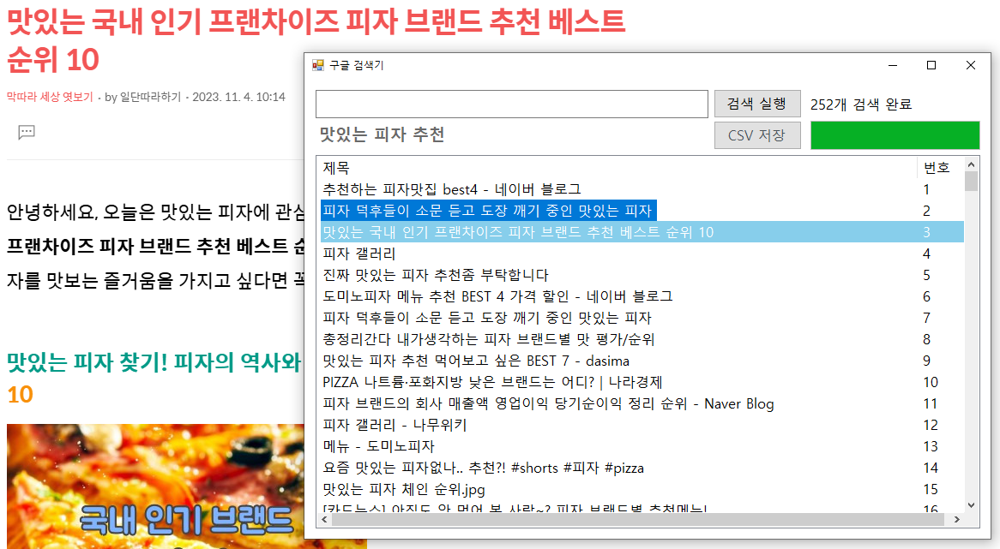

# PuGaYo

## 요약

## 상세

6번째 PJT

### 0. 목차

1. 소개
2. 기술 스택
3. 느낀 점
4. 기능 (페이지 구성)
5. 아쉬웠던 부분
6. 앞으로 학습할 것들, 나아갈 방향
7. 어려웠던 부분, 해결한 과정

## 1. 소개

**PuGaYo**

주제

- `C#` `Windows Forms` 애플리케이션
- 구글 검색을 했을 때, 페이지를 넘겨 가며 보는 것이 번거롭다
- 한번에 결과를 확인하고 싶다
- 해당 검색어에 대한 결과의 목록을 한번에 볼 수 있게 하는 애플리케이션
- `PuppeteerSharp`를 이용해 구글 검색 결과를 가져옴
- 리스트 뷰에서 클릭해 해당 링크로 자동 이동
- 검색 결과는 CSV 파일로 저장할 수도 있음

## 2. 기술 스택

<!-- C# -->

<!-- .NET -->

## 3. 느낀 점

- `Java`와 비슷하다는 `C#`을 처음 배웠는데, `Java`도 배워본 적이 없어 까다로웠다
- 프로젝트를 진행하며 `C#`은 좋은 언어라는 생각이 들었다
- `Windows Forms`를 이용해 데스크탑 앱을 간단하고 쉽게 만들 수 있어 신기했다

## 4. 기능 (페이지 구성)

1. 입력창, 버튼
2. 상태창
3. CSV 저장 버튼
4. 프로그레스 바
5. 검색어 표시
6. 검색 결과 리스트 뷰

|                                                       |                                                        |                                                       |
| :---------------------------------------------------: | :----------------------------------------------------: | :---------------------------------------------------: |
|   초기 화면     | 검색어 입력  |  검색 실행   |
| 검색 실행 2  |    검색 성공     | 결과 출력 1  |
| 결과 출력 2  |    출력 완료     |   결과 저장     |

아이템 클릭 (해당 링크로 이동)

시연 영상

- `assets` 폴더 내

## 5. 아쉬웠던 부분

- 프로젝트 중 다른 일로 인해 많은 시간을 쏟을 수 없었음
- `C#` 문법에 익숙하지 않아 코드가 길어져서 아쉬움
- `Windows Forms`로 작업하는 것이 처음이라, 기능 구현을 우선하고 디자인은 신경쓰지 않은 점이 아쉬움

## 6. 앞으로 학습할 것들, 나아갈 방향

- `C#`에 흥미가 생겨 문법을 더 공부하는 중
- `ASP .NET Core`에도 관심이 있어 가벼운 서버 프로젝트를 진행할 예정

## 7. 어려웠던 부분, 해결한 과정

`Task`

### C#

---

### indexedDB

- 처음 사용해보는 웹 스토리지 기능이어서 검색, 문서 읽기를 통해 구현
- 다른 DB와 기능은 비슷했지만, 좀 다른 점이 있었고(버전 등) 명칭이 달라 약간 낯설었음

### CSS, TailwindCSS

- Flex 자식 요소들이 너비를 갖지 않아 헤매다가, 부모 요소, 자식 요소에 `w-full` 클래스를 주어 해결
- 거래내역 생성 폼에서 수입·지출 버튼을 라디오 버튼으로 만드는 중에 라디오 버튼을 꾸미기 힘들어 시간이 걸렸지만, `<label>` 태그 안에 `<input type="radio />`와 `
` 태그를 넣어 해결. `<input />` 태그를 숨기는 트릭과 `peer`에 대해 알게 되었음

### JavaScript

- `Intl` API를 통해 손쉽게 금액의 세자리수마다 쉼표를 찍어줄 수 있었음. 폼에 입력할 때도 쉼표를 붙여줌
- 파일 분할이 되지 않아 늘어나는 코드를 관리하기 힘들었음. 결국 `Vite`를 사용해 프로젝트 관리
- 파일을 분할해서 UI 관련 기능, indexedDB 접근 관련 기능, 기타 로직을 나누고 싶었음
  - UI 관련 함수에서 또 다른 함수를 호출하는데 그 함수는 indexedDB 관련 함수를 호출하는 등 코드 흐름이 복잡해져서 관리가 힘들어 고민
  - 각자 할 일만 하고, 커스텀 이벤트를 통해 해당 이벤트 핸들러에서 로직 관리
  - `document`의 이벤트 핸들러는 모두 `index.js`에서 관리. 보기 편하고 관리하기 좋아짐
  - 작업 흐름이 보여 관리하기 쉬워져 만족
- `document.addEventListener`에 등록하는 콜백을 `async` 함수로 해도 될지 찾아봤는데 문제 없을 것 같아 적용
- 분리한 파일들의 이름을 어떻게 지을지 고민이 됐음
  - 해당 파일에서 UI 등록하는 부분, 다른 로직을 담당하는 부분을 더 나눌까 고민했지만 코드 양이 그렇게 많지 않아 나누지 않음
- `Vite` 번들러를 이용해 모듈로 나눈 경우(`type: "module"`이 된 경우), `index.html`에서 이벤트 핸들러 인식이 되지 않아 `window` 객체에 전역으로 등록해서 해결

날짜 헤딩 넣기

### 배포 (GitHub Pages)

- `GitHub Pages`에 배포가 잘 되지 않는 문제
  - 배포된 사이트에 들어가보니, `html` 파일만 있고 `js` 파일을 불러오지 못한 것 같아 네트워크 탭으로 확인해보니, `style.css` 파일과 `js` 파일 일부분을 불러오는 데에 실패
  - 해당 `js` 파일은 다른 파일에서 불러올 때 파일 이름에 `.js`를 명시해주지 않아 불러오는 데에 실패함
  - `<link />` 태그에서 `href="src/style.css"`라고 썼어야 하는데, `/src` 라고 작성해서 실패. 작성을 잘 하자
